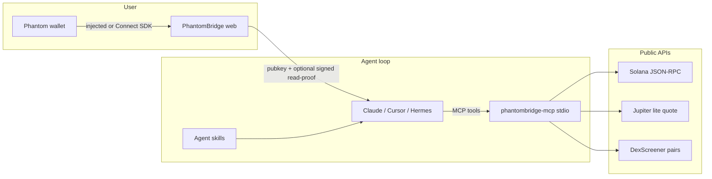

# PhantomBridge

Read-only **Solana wallet MCP** plus a small Phantom web app and agent skills. Built for [Kevin Lance Murray](https://github.com/HEADWOPZ) (`HEADWOPZ/phantombridge`).

Any MCP client (Claude Desktop, Cursor, Hermes, …) can:

- read a Phantom-linked or raw Solana pubkey
- summarize balances and recent activity
- score mint / LP risk from **public** APIs
- quote Jupiter swaps
- draft revoke / approval hygiene

**v1 does not take custody, does not store private keys, and does not execute swaps or revokes.**

## 60-second install

```bash
git clone https://github.com/HEADWOPZ/phantombridge.git
cd phantombridge

python3 -m venv .venv
source .venv/bin/activate   # Windows: .venv\Scripts\activate
pip install -e ".[dev]"
pytest -q

# optional web desk
cd web && cp .env.example .env && npm install && npm run dev
```

Smoke-test tools without an MCP host (uses public RPC / Jupiter):

```bash
# System program (always valid pubkey)
python -m phantombridge_mcp.cli get_balances 11111111111111111111111111111111

# Quote 0.1 SOL → USDC (base units)
python -m phantombridge_mcp.cli jupiter_quote \
  So11111111111111111111111111111111111111112 \
  EPjFWdd5AufqSSqeM2qN1xzybapC8G4wEGGkZwyTDt1v \
  100000000
```

Run the MCP server on **stdio** (what Claude / Cursor spawn):

```bash
phantombridge-mcp
# equivalent: python -m phantombridge_mcp
```

## Architecture



| Piece | Stack | Role |
| --- | --- | --- |
| `phantombridge-mcp` | Python 3.11+ / MCP Python SDK (`MCPServer` / FastMCP) | Five read-only tools, stdio transport |
| `web/` | React + Vite + Phantom Connect SDK | Connect, balances, sign session |
| `skills/` | Markdown + YAML | `wallet-overview`, `pre-trade-check`, `approval-audit` |

## MCP tools

All tools return structured JSON: `{ "ok": true, ... }` or `{ "ok": false, "error": { "code", "message", "details" } }`. Every payload includes `"read_only": true`.

| Tool | What it does |
| --- | --- |
| `get_balances` | SOL + SPL / Token-2022 accounts for a pubkey |
| `get_recent_txs` | Recent signatures + parsed type hints |
| `token_risk_snapshot` | Mint authorities, signature-age bound, DexScreener LP hints, heuristic score |
| `jupiter_quote` | Jupiter Swap API quote only — **no transaction** |
| `suggest_revokes` | Delegates, close/freeze/mint authority findings — **draft only** |

Common arguments: `pubkey` (base58) and optional `session_token` (from the web app). If `PHANTOMBRIDGE_REQUIRE_SESSION=1`, the token is mandatory and must verify.

### Claude Desktop

Merge [`examples/claude_desktop_config.json`](examples/claude_desktop_config.json) into `claude_desktop_config.json` (macOS: `~/Library/Application Support/Claude/`).

```json
{
  "mcpServers": {
    "phantombridge": {
      "command": "phantombridge-mcp",
      "env": {
        "SOLANA_RPC_URL": "https://api.mainnet-beta.solana.com",
        "JUPITER_API_URL": "https://lite-api.jup.ag"
      }
    }
  }
}
```

If `phantombridge-mcp` is not on `PATH`, use:

```json
{
  "command": "/ABS/PATH/.venv/bin/python",
  "args": ["-m", "phantombridge_mcp"]
}
```

### Cursor

Add the same server block to Cursor MCP settings, or copy [`examples/cursor_mcp.json`](examples/cursor_mcp.json). Restart Cursor after saving.

Point the agent at `skills/*/SKILL.md` (project skills or your user skills folder).

## Web mini-app

```bash
cd web
cp .env.example .env
npm install
npm run dev
```

Open http://localhost:5173

- **No App ID:** injected Phantom only (local demo).
- **With App ID:** Phantom Connect SDK — injected plus optional Google/Apple. Get an ID at [phantom.com/portal](https://phantom.com/portal) and allowlist `http://localhost:5173` + `/callback`.

The signed **read-proof** is pubkey-bound, TTL default 15 minutes, verified with Ed25519 on the MCP side. The server never sees a private key.

## Environment variables

See [`.env.example`](.env.example). Nothing invents a paid key.

| Variable | Default | Notes |
| --- | --- | --- |
| `SOLANA_RPC_URL` | `https://api.mainnet-beta.solana.com` | Public JSON-RPC (rate limited). PublicNode may block `getTokenAccountsByOwner`. Helius / Triton optional. |
| `PHANTOMBRIDGE_REQUIRE_RPC` | `0` | If `1` and URL empty → `RPC_MISSING` |
| `JUPITER_API_URL` | `https://lite-api.jup.ag` | Public lite Swap API |
| `JUPITER_API_KEY` | unset | Optional Jupiter portal key |
| `DEXSCREENER_API_URL` | `https://api.dexscreener.com` | Public pair / LP hints |
| `PHANTOMBRIDGE_REQUIRE_SESSION` | `0` | Require web-app read-proof |
| `PHANTOMBRIDGE_BOUND_PUBKEY` | unset | Pin tools to one wallet |
| `PHANTOMBRIDGE_HTTP_TIMEOUT` | `20` | Seconds |
| `VITE_PHANTOM_APP_ID` | empty | Web: Portal app id; empty = injected-only |
| `VITE_PHANTOM_REDIRECT_URL` | `http://localhost:5173/callback` | OAuth allowlist |
| `VITE_SOLANA_RPC_URL` | public mainnet | Web balance fetch |
| `VITE_SESSION_TTL_SECONDS` | `900` | Read-proof lifetime |

Clear failures: empty RPC with `PHANTOMBRIDGE_REQUIRE_RPC=1` → `RPC_MISSING`; dead endpoint → `RPC_UNREACHABLE` / `RPC_TIMEOUT`; bad Jupiter payload → `QUOTE_PARSE` / `JUPITER_ERROR`.

## Security model

- **Read-only v1.** Tools fetch public chain/API data. They do not assemble, sign, or broadcast transactions.
- **No custody.** The MCP process never asks for, accepts, or writes seed phrases or private keys.
- **Pubkey or proof.** A raw pubkey is enough (public data). A session token is an Ed25519 signature over a canonical `PhantomBridge read-proof` message bound to that pubkey and an expiry.
- **Optional bind.** `PHANTOMBRIDGE_BOUND_PUBKEY` + `PHANTOMBRIDGE_REQUIRE_SESSION` stop a confused agent from querying a different wallet.
- **Heuristics, not oracles.** Risk scores use mint authorities, a lower-bound mint age from `getSignaturesForAddress`, and DexScreener liquidity. They are not a rug-pull detector.
- **User still signs.** Any revoke or swap the user wants must happen in Phantom (or another wallet UI) after they read the simulation.

## Agent skills

| Skill | Path | When to use |
| --- | --- | --- |
| Wallet overview | [`skills/wallet-overview/SKILL.md`](skills/wallet-overview/SKILL.md) | Holdings + activity |
| Pre-trade check | [`skills/pre-trade-check/SKILL.md`](skills/pre-trade-check/SKILL.md) | Mint risk + Jupiter quote |
| Approval audit | [`skills/approval-audit/SKILL.md`](skills/approval-audit/SKILL.md) | Delegates / authorities |

## Tests

```bash
pip install -e ".[dev]"
pytest -q
```

Coverage includes pubkey validation, session verify/expiry, risk bands, Jupiter quote parsing, and RPC-missing errors.

## License

[MIT](LICENSE) © 2026 Kevin Lance Murray. See [CONTRIBUTING.md](CONTRIBUTING.md).
